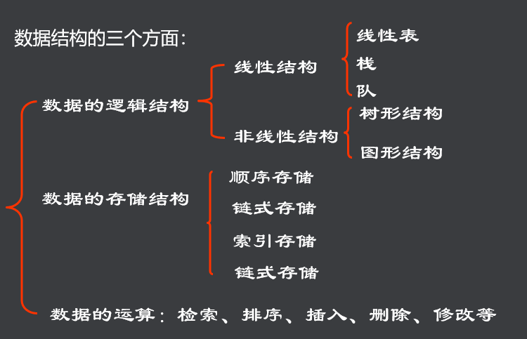

---
​---
 
 
typora-root-url: ../图像
​---
---

# 什么是数据结构

- 数据结构研究计算机数据间关系
- 包括数据的逻辑结构和存储结构及其操作

# 基本概念

1. 数据（Data）

   > 数据即信息的载体，是能够输入到计算机中并且能被计算机识别、存储和处理的符号总称。

2. 数据元素（Data Element）

   > 数据元素是数据的基本单位，又称之为记录（Record）。一般，数据元素由若干基本项（或称字段、域、属性）组成。 

