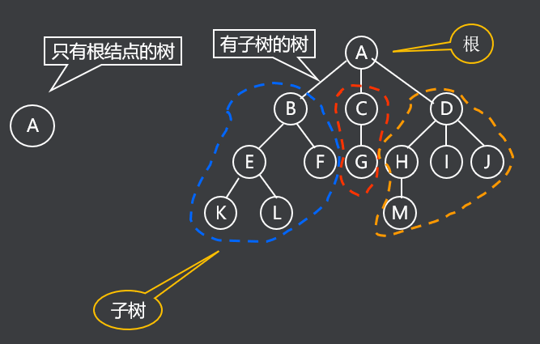
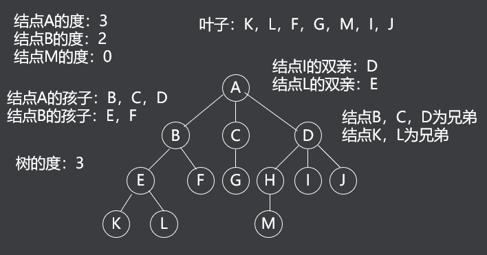
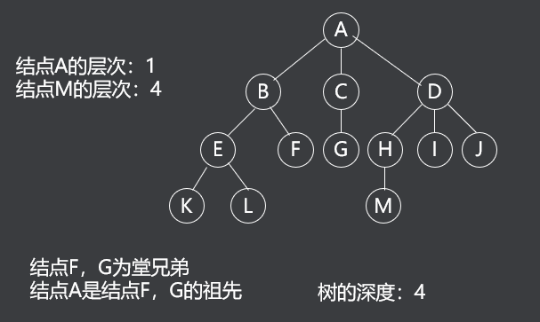
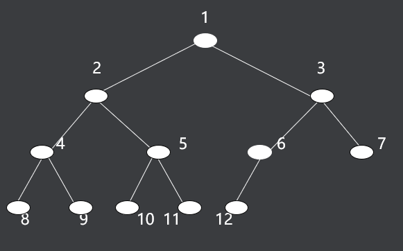
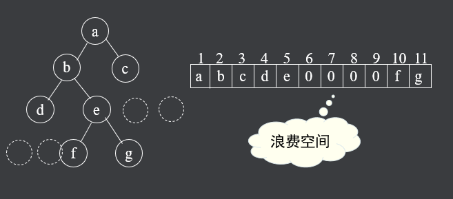
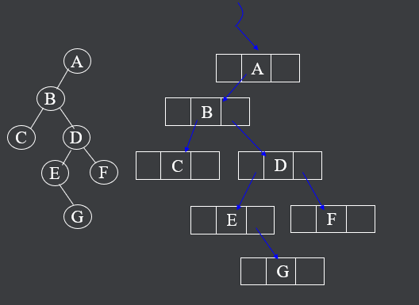

# 树的概念

树（Tree）是$n（n≥0）$个节点的有限集合T，它满足两个条件 ：

1. 有且仅有一个特定的称为根（Root）的节点；
2. 其余的节点可以分为$m（m≥0）$个互不相交的有限集合$T1、T2、……、Tm$，其中每一个集合又是一棵树，并称为其根的子树

表示方法 ：**树形表示法**、**目录表示法**。



- 一个节点的子树的个数称为该节点的**度数**
- **一棵树的度数**是指该树中节点的最大度数。
- 度数为零的节点称为**树叶**或**终端节点**
- 度数不为零的节点称为分支节点
- 除根节点外的分支节点称为内部节点。



- 一个节点系列$k1,k2, ……,ki,ki+1, ……,kj,$并满足$ki$是$ki+1$的父节点，就称为一条从$k1$到$kj$的**路径**
- 路径的长度为$j-1$,即路径中的**边数**。
- 路径中前面的节点是后面节点的**祖先**，后面节点是前面节点的**子孙**。 
- 节点的层数等于父节点的层数加一，根节点的层数定义为一。树中节点层数的最大值称为该树的**高度或深度**。



- 若树中每个节点的各个子树的排列为从左到右，不能交换，即兄弟之间是有序的，则该树称为**有序树**。
- m（m≥0）棵互不相交的树的集合称为**森林**。
- 树去掉根节点就成为森林，森林加上一个新的根节点就成为树。

**树的逻辑结构** ：树中任何节点都可以有零个或多个直接后继节点（子节点），但至多只有一个直接前趋节点（父节点），根节点没有前趋节点，叶节点没有后继节点。 


# 二叉树的原理

### 二叉树的概念

**二叉树**是n（n≥0）个节点的有限集合

或者是空集（n＝0）

或者是由一个根节点以及两棵互不相交的、分别称为左子树和右子树的二叉树组成.

严格区分左孩子和右孩子，即使只有一个子节点也要区分左右。

### 二叉树的性质

- 二叉树第i（i≥1）层上的节点最多为2^i^^-1^个。
- 深度为k（k≥1）的二叉树最多有2^k^－1个节点。

**满二叉树** ：深度为k（k≥1）时有2^k^－1个节点的二叉树。

**完全二叉树** ：只有最下面两层有度数小于2的节点，且最下面一层的叶节点集中在最左边的若干位置上。

具有n个节点的完全二叉树的深度为$（log2n）＋1或『log2(n+1)$。

### 二叉树顺序存储

**顺序存储结构** ：完全二叉树节点的编号方法是从上到下，从左到右，根节点为1号节点。设完全二叉树的节点数为n，某节点编号为i

> 当i＞1（不是根节点）时，有父节点，其编号为i/2;
>
> 当2*i≤n时，有左孩子，其编号为2*i ,否则没有左孩子，本身是叶节点;
>
> 当2*i＋1≤n时，有右孩子，其编号为2*i+1 ,否则没有右孩子；
>
> 当i为奇数且不为1时，有左兄弟，其编号为i-1,否则没有左兄弟；
>
> 当i为偶数且小于n时，有右兄弟，其编号为i＋1,否则没有右兄弟；



**存储空间浪费：**有n个节点的完全二叉树可以用有n+1个元素的数组进行顺序存储，节点号和数组下标一一对应，下标为零的元素不用。

利用以上特性，可以从下标获得节点的逻辑关系。不完全二叉树通过**添加虚节点**构成完全二叉树，然后用数组存储，这要浪费一些存储空间。



### 二叉树链式存储

二叉树由根节点指针决定。 

```c
typedef int data_t ; 

typedef struct node_t; 

{
 data_t data ;  
 struct node_t *left ,*right;  
} bitree_t ;  

bitree_t *root ;  //二叉树由根节点指针决定。 
```



# 二叉树的实现

### 二叉树的遍历

由于二叉树的递归性质，遍历算法也是递归的。三种基本的遍历算法如下 ：

- **先序遍历：**先访问**树根**，再访问左子树，最后访问右子树；
- **中序遍历：**先访问左子树，再访问**树根**，最后访问右子树；
- **后序遍历：**先访问左子树，再访问右子树，最后访问**树根**；


### 创建树

> 先序遍历的方式创建树

```c
bitree * tree_create() {
	data_t ch;
	bitree *r;

    scanf("%c", &ch);
    if (ch == '#')
        return NULL;

    if ((r = (bitree *)malloc(sizeof(bitree))) == NULL) {
        printf("malloc failed\n");
        return NULL;
    }
    r->data = ch;
    r->left  = tree_create(); 
    r->right = tree_create(); 
    return r;
}
```

### 先序遍历

```c
void preorder(bitree * r) {
	if (r == NULL) {
		return;
	}
	printf("%c", r->data);
	preorder(r->left);
	preorder(r->right);
}
```

### 中序遍历

```c
void inorder(bitree * r) {
	if (r == NULL) {
		return;
	}
	inorder(r->left);
	printf("%c", r->data);
	inorder(r->right);
}
```

### 后序遍历

```c
void postorder(bitree * r) {
	if (r == NULL) {
		return;
	}
	postorder(r->left);
	postorder(r->right);
	printf("%c", r->data);
}
```

