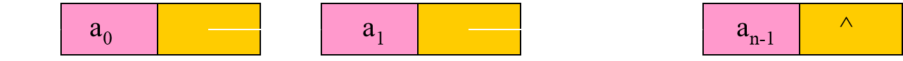

# 线性表

### 线性表L可用二元组形式描述：

$$
L= (D,R)
$$

### 即线性表L包含数据元素集合D和关系集合R

$$
D={ai | ai∈datatype ,i=0,1,2, ∙∙∙∙∙∙∙∙∙n-1 ,n≥0}
$$

$$
R={<ai , ai+1> | ai , ai+1∈D, 0≤i≤n-2}
$$

> ​	关系符<a~i,~ a~i+1~>在这里称为有序对
>
> ​	表示任意相邻的两个元素之间的一种先后次序关系
>
> ​	a~i~是a~i+1~的直接前驱, a~i+1~是a~i~的直接后继

### 线性表的特征

- 对非空表,a~0~是表头,无前驱
- a~n-1~是表尾,无后继
- 其它的每个元素a~i~有且仅有一个直接前驱a~i-1~和一个直接后继a~i+1~


# 线性表顺序存储（==顺序表==）

### 顺序存储结构的表示

​	若将线性表$L=(a0,a1, ……,an-1)$中的各元素依次存储于计算机一片连续的存储空间。

设$Loc(ai)$为$ai$的地址，$Loc(a0)=b$，每个元素占d个单元 则：$Loc(ai)=b+i*d$       

### 顺序存储结构的特点

- 逻辑上相邻的元素 ai, ai+1，其存储位置也是相邻的
- 对数据元素ai的存取为随机存取或按地址存取
- 存储密度高
- 存储密度D=(数据结构中元素所占存储空间)/（整个数据结构所占空间）

### 顺序存储结构的不足

- 对表的插入和删除等运算的时间复杂度较差

# 顺序表的构建（C语言）

在C语言中，可借助于一维数组类型来描述线性表的顺序存储结构

#### 顺序表结构体

```c
typedef struct {
	data_t data[N];
	int last;
}sqlist, *sqlink;
```

#### 创建顺序表

```c
sqlink list_create() {
	//malloc
	sqlink L;

    L =(sqlink)malloc(sizeof(sqlist));
    if (L == NULL) {
        printf("list malloc failed\n");
        return L;
    }

    //initialize
    memset(L, 0, sizeof(sqlist));
    L->last = -1;

    //return
    return L;
}
```

#### 清空顺序表

```c
/*
 * @ret   0-success   -1-failed
 * */
   int list_clear(sqlink L) {
   if (L == NULL)
   	return -1;

   memset(L, 0, sizeof(sqlist));
   L->last = -1;

   return 0;
   }
```

#### 删除顺序表

```c
int list_delete(sqlink L){
	if (L == NULL) 
		return -1;
	free(L);
	L = NULL;
	return 0;
}
```

#### 判断顺序表是否为空

```c
/*
 * list_empty: Is list empty?
 * para L: list
 * @ret  1--empty   0--not empty
 * */
   int list_empty(sqlink L) {
   if (L->last == -1) 
   	return 1;
   else 
   	return 0;
   }
```

#### 顺序表的长度

```c
int list_length(sqlink L) {
	if (L == NULL) 
		return -1;
	return (L->last+1);
}
```

#### 确定某个值的位置

```c
int list_locate(sqlink L, data_t value) {
	int i ;
	for (i = 0; i <= L->last; i++) {
		if (L->data[i] == value) 
			return i;
	}
	return -1;
}
```

#### 插入操作

```c
int list_insert(sqlink L, data_t value, int pos) {
	int i;

//full
if (L->last == N-1) {
	printf("list is full\n");
	return -1;
}

//check para    0<=pos<=Last+1   [0, last+1]
if (pos < 0 || pos > L->last+1) {
	printf("Pos is invalid\n");
	return -1;
}

//move
for (i = L->last; i >= pos; i--) {
	L->data[i+1] = L->data[i];
}

//update value last
L->data[pos] = value;
L->last++;

return 0;
}
```

#### 删除操作

```c
int list_delete(sqlink L, int pos) {
	int i;

if (L->last == -1) {
	printf("list is empty\n");
	return -1;
}

//pos [0, last]
if (pos < 0 || pos > L->last) {
	printf("delete pos is invalid\n");
	return -1;
}

//move  [pos+1, last]
for (i = pos+1; i <= L->last; i++) {
	L->data[i-1] = L->data[i];
}

//update
L->last--;

return 0;
}
```

#### 展示顺序表

```c
int list_show(sqlink L) {
	int i;

if (L == NULL) 
	return -1;
if (L->last == -1)
	printf("list is empty\n");

for (i = 0; i <= L->last; i++) {
	printf("%d ", L->data[i]);
}
puts("");

return 0;
}
```

#### 合并顺序表

```c
int list_merge(sqlink L1, sqlink L2) {
	int i = 0;
	int ret;

while (i <= L2->last){
	ret = list_locate(L1, L2->data[i]);
	if (ret == -1) {
		if (list_insert(L1, L2->data[i], L1->last+1) == -1) 
			return -1;
	}
	i++;
}
return 0;
}
```

# 线性表链式存储（==单链表==）

### 链式存储结构的表示

- 将线性表$L=(a0,a1,……,an-1)$中各元素分布在存储器的不同存储块，称为结点，通过地址或指针建立元素之间的联系  


- ​	结点的data域存放数据元素a~i~，而next域是一个指针，指向a~i~的直接后继a~i+1~所在的结点。



### 结点类型描述

```c
   typedef  struct node
       
   {  
       data_t  data;  //结点的数据域//
       struct node *next; //结点的后继指针域//

   }listnode, *linklist;
```

#### 可调用C语言中==$malloc()$函数==向系统申请结点的存储空间

```c
      linklist p; 
      p = (linklist)malloc(sizeof(listnode));
    //创建一个类型为linklist的结点，且该结点的地址已存入指针变量p中：
```

### **单链表的优缺点**

优点

1. 是动态数据结构，可随时是链表分配和取消内存来增长或者缩短链表，不用给链表初始化大小
2. 插入和删除操作简单，不必移动元素

缺点

1. 遍历链表会比较麻烦，不能用索引的方式

# 链表的构建（C语言）

### 创建链表

```c
linklist list_create() {
	linklist H;

    H = (linklist)malloc(sizeof(listnode));
    if (H == NULL) {
        printf("malloc failed\n");
        return H;
    }

    H->data = 0;
    H->next = NULL;

    return H;
}
```

### 链表尾部插入

```c
int list_tail_insert(linklist H, data_t value) {
	linklist p;
	linklist q;

if (H == NULL) {
	printf("H is NULL\n");
	return -1;
}

//1 new node p
if ((p = (linklist)malloc(sizeof(listnode))) == NULL) {
	printf("malloc failed\n");
	return -1;
}
p->data = value;
p->next = NULL;

//2 locate tail node 
q = H;
while (q->next != NULL) {
	q = q->next;
}

//3 insert
q->next = p;

return 0;
}
```

### 获得链表第pos个节点

```c
int list_tail_insert(linklist H, data_t value) {
	linklist p;
	linklist q;

if (H == NULL) {
	printf("H is NULL\n");
	return -1;
}

//1 new node p
if ((p = (linklist)malloc(sizeof(listnode))) == NULL) {
	printf("malloc failed\n");
	return -1;
}
p->data = value;
p->next = NULL;

//2 locate tail node 
q = H;
while (q->next != NULL) {
	q = q->next;
}

//3 insert
q->next = p;

return 0;

}
```

### 指定位置插入

```c
int list_insert(linklist H, data_t value, int pos) {
	linklist p;
	linklist q;

if (H == NULL) {
	printf("H is NULL\n");
	return -1;
}

//1 locate node p (pos-1)
p = list_get(H, pos-1);
if (p == NULL) {
	return -1;
}

//2 new node q
if ((q = (linklist)malloc(sizeof(listnode))) == NULL) {
	printf("malloc failed\n");
	return -1;
}
q->data = value;
q->next = NULL;

//3 insert
q->next = p->next;
p->next = q;

return 0;
}
```

### 删除指定位置节点

```c
int list_delete(linklist H, int pos) {
	linklist p;
	linklist q;

//1
if (H == NULL) {
	printf("H is NULL\n");
	return -1;
}

//2 locate prior
p = list_get(H, pos-1);
if (p == NULL) 
	return -1;
if (p->next == NULL) {
	printf("delete pos is invalid\n");
	return -1;
}

//3 update list
q = p->next;
p->next = q->next;//p->next = p->next->next;

//4 free
printf("free:%d\n", q->data);
free(q);
q = NULL;

return 0;
}
```

### 展示链表

```c
int list_show(linklist H) {
	linklist p;

if (H == NULL) {
	printf("H is NULL\n");
	return -1;
}

p = H;

while (p->next != NULL) {
	printf("%d ", p->next->data);
	p = p->next;
}
puts("");

return 0;

}
```

### 删除链表

```c
linklist list_free(linklist H) {
	linklist p;

if (H == NULL) 
	return NULL;

p = H;

printf("free:");
while (H != NULL) {
	p = H;
	printf("%d ", p->data);
	free(p);
	H = H->next;
}
puts("");

return NULL;

}
```

### 逆转链表

```c
int list_reverse(linklist H) {
	linklist p;
	linklist q;

if (H == NULL) {
	printf("H is NULL\n");
	return -1;
}

if (H->next == NULL || H->next->next == NULL) {
	return 0;
}

p = H->next->next;
H->next->next = NULL;

while (p != NULL) {
	q = p;
	p = p->next;

​	q->next = H->next;
​	H->next = q;
}

return 0;

}
```

### 合并链表

```c
int list_merge(linklist H1, linklist H2) {
	linklist p, q, r;

if (H1 == NULL || H2 == NULL) {
	printf("H1 || H2 is NULL\n");
	return -1;
}

p = H1->next;
q = H2->next;
r = H1;
H1->next = NULL;
H2->next = NULL;

while (p && q) {
	if (p->data <= q->data) {
		r->next = p;
		p = p->next;
		r = r->next;
		r->next = NULL;
	} else {
		r ->next = q;
		q = q->next;
		r = r->next;
		r->next = NULL;
	}
}

if (p == NULL) {
	r->next = q;
}else {
	r->next = p;
}

return 0;

}
```

